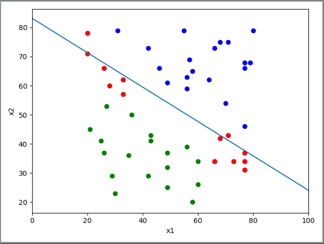

## SVM(支持向量机)
 
代码查看：[SVM.py](SVM.py)  
  
数据集：[data.txt](data.txt)   

***

对于SVM问题有多种解决方案，以下采用 **SMO（序列最小最优化算法）**，无核函数   
 
SMO算法：  
输入：训练数据集，T = {(x_1,y_1),....,(x_n,y_n)},其中 y_i = {+1,-1}  
&emsp;&emsp;精度 toler  
&emsp;&emsp;松弛变量 C  
输出： 常数 b  
&emsp;&emsp;拉格朗日乘子 &alpha;   

1)取初值&alpha; = 0, k = 1  
2)选择优化变量&alpha;1,&alpha;2, 解析求解两个变量的最优化问题  
&emsp;&emsp;对于优化变量的选择，&alpha;1取违反KKT最严重的变量, KKT: 
&emsp;&emsp;  
&emsp;&emsp;对于&alpha;2_new,则必须满足一下条件： 
&emsp;&emsp;  
&emsp;&emsp;未经裁剪的&alpha;2_new的解为： 
&emsp;&emsp;&alpha;2_unc = &alpha;2_old+ y2 \* (E1-E2) / &eta; 
&emsp;&emsp;&eta; = K11 + K22-2 \* K12  
&emsp;&emsp;裁剪后的&alpha;2的解为：  
&emsp;&emsp; 
&emsp;&emsp;更新第一个变量：  
&emsp;&emsp;&emsp;&emsp;&alpha;1_new = &alpha;1_old + y1\*y2\*(&alpha;2_old-&alpha;2_new) 
&emsp;&emsp;然后更新b： 
&emsp;&emsp;&emsp;&emsp;b1_new = b_old - E1 - y1\*K11\*(&alpha;1_new - &alpha;1_old) - y2\*K21\*(&alpha;2_new - &alpha;2_old)  
&emsp;&emsp;&emsp;&emsp;b2_new = b_old - E2 - y1\*K12\*(&alpha;1_new - &alpha;1_old) - y2\*K22\*(&alpha;2_new - &alpha;2_old)  
&emsp;&emsp;同时，如果有 0<&alpha;1_new<C, 则b_new = b1_new,  
&emsp;&emsp;如果0<&alpha;2_new<C, 则b_new = b2_new,  
&emsp;&emsp;否则 b_new = (b1_new + b2_new)/2.0  
  
推荐文章： 
[https://www.cnblogs.com/JustForCS/p/5283489.html](https://www.cnblogs.com/JustForCS/p/5283489.html)  
[https://blog.csdn.net/v_JULY_v/article/details/7624837](https://blog.csdn.net/v_JULY_v/article/details/7624837)  
 

运行结果： 
PS：红色坐标为支持向量 
